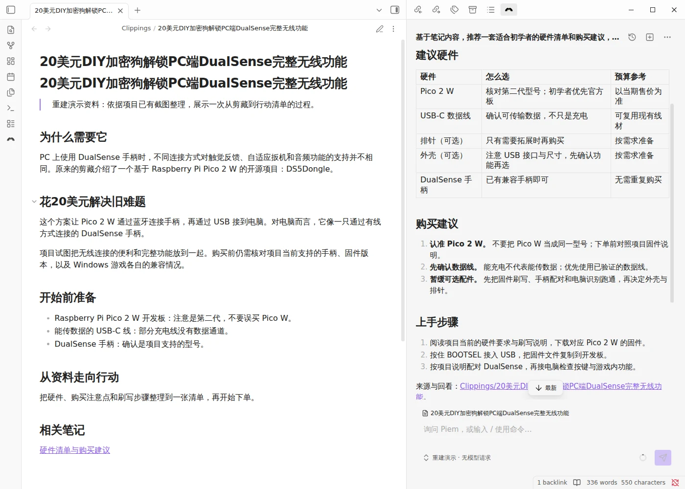
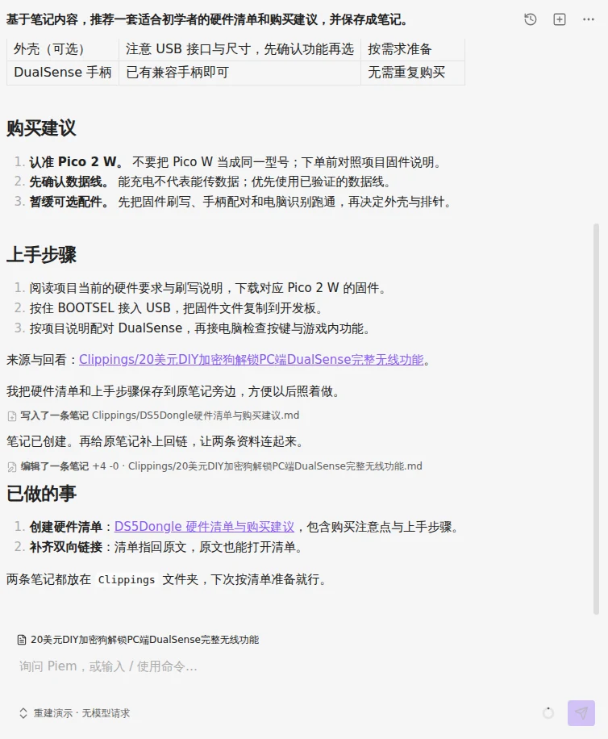
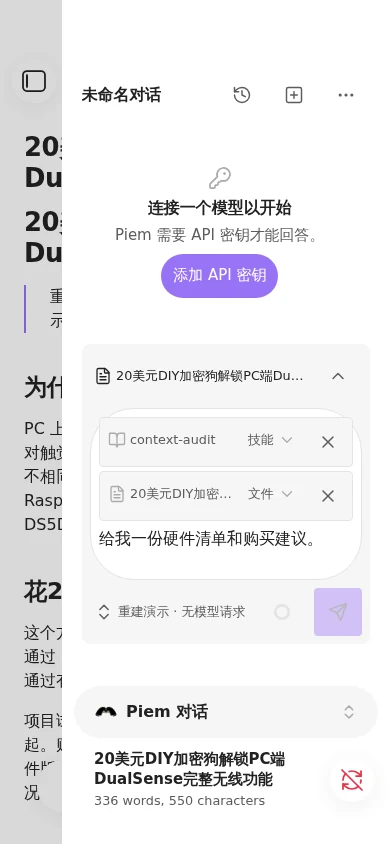
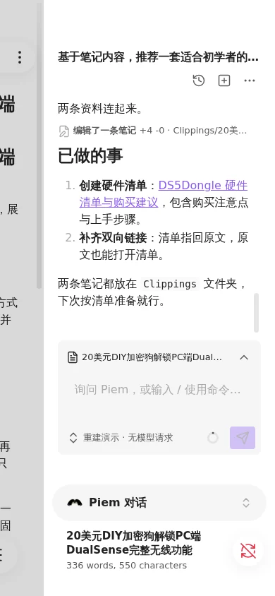

  <picture>
    <source media="(prefers-color-scheme: dark)" srcset="assets/icon.png">
    
  </picture>

<h1 align="center">Piem</h1>

  <b>把你一直拖着没做的那件笔记杂活，交出去。</b>

  一个住在 Obsidian 侧栏里的 AI 编码代理，它真的会改你的笔记。 
  不是把答案贴给你、让你自己粘回去的聊天框。

  
  
  
  

  <a href="README.md">English</a> · 简体中文

  

  你的笔记在左边，代理在右边。示例按旧演示重建，文件操作由真实插件执行。

---

## ▶️ 一次委托，从头到尾

你打开一篇剪藏。几个月前存的，一直没动。你在侧栏里敲：

> **基于笔记内容，推荐一套适合初学者的硬件清单和购买建议。**

  

*当前界面实拍于独立的 Obsidian 示例库。对话文字由脚本编排，插件的读取、写入和编辑工具实际执行。*

它读了那篇笔记，在旁边新建了一条——硬件表、购买建议、上手步骤都在
里面。然后回头给原笔记补了一个指向新笔记的 `[[双向链接]]`，让图谱知道这
两条是一伙的。

动了两个文件：**保存硬件清单，补上双向链接（原笔记 +4 −0）。** 思考和工具调用
收在同一个折叠组里，打开就能看到每一步。回复里交代了改动的是哪两条笔记。

你一个文件都没打开。你只是看了一眼收据，然后接着过自己的日子。

这就是全部的想法。Piem 有手——[二十多个仓库工具](docs/tools.zh-CN.md)——而且
它真的会用。

## ☕ 如果它刚替你省了一个下午

Piem 免费、MIT 许可，而且会一直这样。它是一个人晚上和周末的项目。如果它刚
才替你干完了一小时你一直不想碰的活，请杯咖啡不算过分。

  

疯狂星期四，V 我 50。🍗

## 🧰 它手上还有什么

|  |  |
| --- | --- |
| **二十多个仓库工具** | 读、搜、写、改、移动、丢废纸篓、遍历链接、改 frontmatter、扫任务、驱动编辑器 —— [看全部](docs/tools.zh-CN.md) |
| **子代理，并行跑** | 把自成体系的任务派出去；对话记录彼此隔离，层级在构造上封顶三层，不是靠一句检查 —— [怎么工作](docs/tools.zh-CN.md#子代理) |
| **MCP 服务器** | 远程工具并入代理自己的工具表，带命名前缀，任何一份对话记录都不会谎报某个工具的来处 —— [接一个](docs/extending.zh-CN.md#mcp-服务器) |
| **技能** | 可复用指令，来自内置、你的仓库，或者你早就在给 pi 用的 `~/.pi` 目录。敲 <kbd>/</kbd> 就能调 —— [写一个](docs/extending.zh-CN.md#技能) |
| **跟着你走的上下文** | 你正打开的那篇笔记——路径和正文——每一轮都随消息同行，上下文窗口将满时对话自己压缩 |
| **动作就在手边** | 空面板按你打开的笔记给出起步动作；每条回复下面是复制、插到光标处、追加到笔记，或者让它就地重答一次 |
| **你的端点，你的密钥** | 任何 OpenAI 兼容或 Anthropic-messages 的 base URL，十六个预设开箱可选，能力字段自动填 —— [怎么配](docs/settings.zh-CN.md#模型) |
| **图片** | 粘贴或拖进输入框，随消息一起走 |
| **英文与简体中文** | 默认跟随 Obsidian 自己的语言，想要不一样时可以手动覆盖 |

## ⏱️ 五分钟就能用起来

**1. 装上。** 最省事的是 [BRAT](https://github.com/TfTHacker/obsidian42-brat)：
先从社区插件装 BRAT，然后 **Add beta plugin** → `YoungSx/piem`。以后的更新它
替你管。

想手动装？从 [最新 release](https://github.com/YoungSx/piem/releases/latest)
拿 `main.js`、`manifest.json`、`styles.css`，丢进
`<仓库>/.obsidian/plugins/piem/`，重载 Obsidian，在 **设置 → 第三方插件** 里
启用 **Piem**。

**2. 给它一个脑子。** 打开 **设置 → Piem → Models**，加一个服务商和 API
密钥。默认建议 DeepSeek；任何 OpenAI 兼容或 Anthropic-messages 的端点都行，
**Test** 按钮会走你聊天时实际用的那条传输通道去探测，而不是找条方便的替代。

**3. 问它点什么。** 命令面板 → **Piem: Open chat**，然后把你一直躲着的那件事
说出来。<kbd>Ctrl</kbd>/<kbd>⌘</kbd>+<kbd>Enter</kbd> 发送——或者在
**General** 里改成直接按 <kbd>Enter</kbd>。

想从源码构建？[CONTRIBUTING.md](CONTRIBUTING.md) 里有那五条命令。

## 📱 手机也算一台真电脑

  
  &nbsp;&nbsp;&nbsp;&nbsp;
  

  左：早前的手机实机截图。右：更新后的演示，使用 Obsidian 官方手机模拟。

Piem 的 `isDesktopOnly` 是 `false`，而且是当真的。工具、子代理、技能、图片
——在手机上全都能用。流式输出也能，只要你把它打开。

这份承诺有代价，而且值得让你知道代价是什么。

**MCP 服务器只支持远程。** stdio 传输要拉起子进程，手机做不到。一个在手机上
不可能存在的能力，宁可对所有人都不做，也不做成桌面端的意外惊喜。

**逐字流式默认关着。** Obsidian 的 `requestUrl` 是唯一在所有平台都不受 CORS
约束的通道，而它根本没有增量读取这回事——整段回复攒齐了才一次落下。要真流式
就得用浏览器自己的 `fetch`，多数 endpoint 其实是放行它的；改一个设置就行（模
型 → 网络 → 网络传输）。它之所以不是默认，是因为能不能用是 endpoint 说了算
而不是我们说了算，而本地自己跑的模型通常得手动放行。

## 🔓 装之前先说清楚：它改笔记不问你

**`write` 和 `edit` 之前没有确认步骤。** 没有对话框，没有等你批的 diff。你一
开口，你的笔记就变了。

这是刻意的，也是这笔交易的条款：一个要问你十二次许可的代理，你会停用它。它
反过来向你要的是：

- 让它对着一个你愿意被改动的仓库，也是一个你愿意**发给你的模型服务商**的
  仓库——搜索碰到哪个文件，就把那个文件发出去了；
- 事后读一遍对话记录。每一处改动都来自一次工具调用，每一次工具调用都摆在
  那儿，没藏；
- 把仓库放进版本控制，或者靠 Obsidian 自己的文件恢复。`trash_note` 走的是
  Obsidian 的废纸篓，删掉的东西按常规办法就能捞回来。

你的 API 密钥在桌面端用系统钥匙串密封，在手机上是明文存的——因为那里没有可
以拿来密封的东西，把这件事说出来比含糊过去更好。发布版带
[签名溯源](https://github.com/YoungSx/piem/attestations)，你下载的那串字节
能追回这个仓库。

长版本，同样是这种大白话：[安全与隐私](docs/security.zh-CN.md)。

## 📚 想深挖

| | |
| --- | --- |
| [**代理的工具**](docs/tools.zh-CN.md) | 每一个工具、它做不到的事，以及子代理怎么工作 |
| [**扩展 Piem**](docs/extending.zh-CN.md) | 技能、提示模板、MCP 服务器 |
| [**设置**](docs/settings.zh-CN.md) | 服务商与模型、聊天行为、命令、会话存在哪 |
| [**安全与隐私**](docs/security.zh-CN.md) | 什么会离开你的仓库、密钥存在哪、Obsidian 审核会点名的那些能力 |

想参与？[CONTRIBUTING.md](CONTRIBUTING.md) 看流程，[AGENTS.md](AGENTS.md)
看约定。

## 🙏 站在别人的肩膀上

Piem 跑在 [`@earendil-works/pi-agent-core`](https://github.com/earendil-works/pi-mono)
上，也就是 pi 的代理运行时——所以你早先为 pi 写的技能，在这里原样可用。

它是从 [`lhr0909/pi-obsidian`](https://github.com/lhr0909/pi-obsidian) 长出来
的。谢谢那个起点。

MIT 许可。第三方声明在 [THIRD_PARTY_NOTICES.md](THIRD_PARTY_NOTICES.md)。
